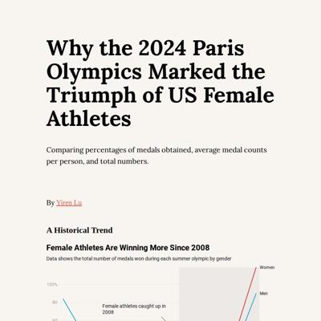
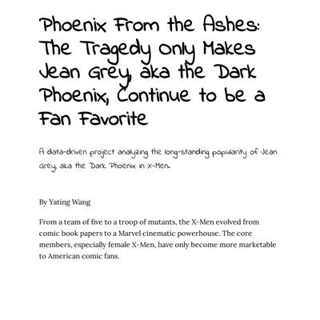
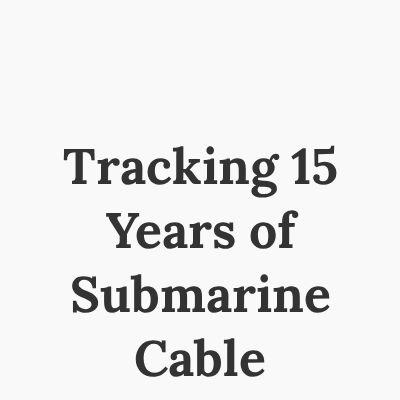
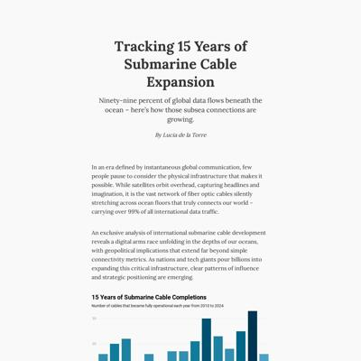
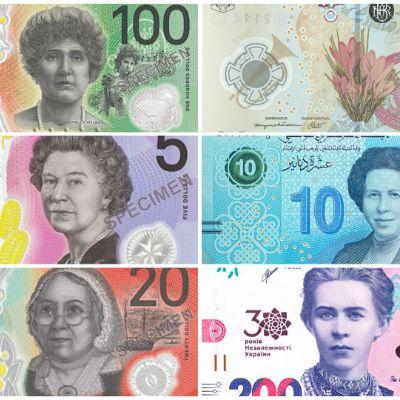
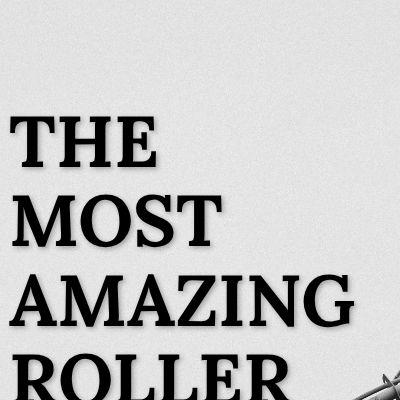
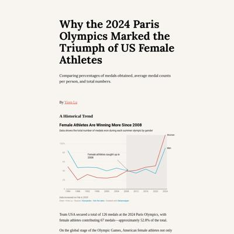
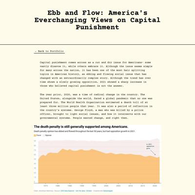
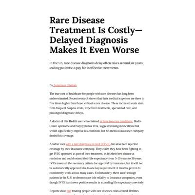
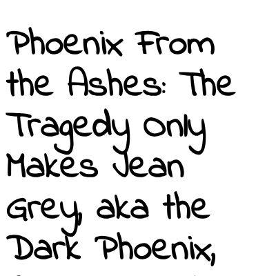

# Data Studio 2025 Personal Projects Test Page

Quick checks to make sure our pages are looking their best!

<table><tr><td><a href="#hazel-gandhigithubio"> hazel-gandhi.github.io</a></td>
<td><a href="#lg3394githubio"> lg3394.github.io</a></td>
<td><a href="#somaiyahhafeezgithubio"> somaiyahhafeez.github.io</a></td>
<td><a href="#gracejiang0612githubio"> gracejiang0612.github.io</a></td>
</tr><tr>
<td><a href="#rosakettumakigithubio"> rosakettumaki.github.io</a></td>
<td><a href="#ashley-yihui-leegithubio"> ashley-yihui-lee.github.io</a></td>
<td><a href="#yiren54610githubio"> yiren54610.github.io</a></td>
<td><a href="#amethystmartgithubio"> amethystmart.github.io</a></td>
</tr><tr>
<td><a href="#annikamcginnisgithubio"> annikamcginnis.github.io</a></td>
<td><a href="#rm4063githubio"> rm4063.github.io</a></td>
<td><a href="#cj-robinsongithubio"> cj-robinson.github.io</a></td>
<td><a href="#anusha0712githubio"> anusha0712.github.io</a></td>
</tr><tr>
<td><a href="#suiumkanulanbekgithubio"> suiumkanulanbek.github.io</a></td>
<td><a href="#chilinhhovogithubio"> chilinhhovo.github.io</a></td>
<td><a href="#tiff-xwanggithubio"> tiff-xwang.github.io</a></td>
<td><a href="#yatingw24githubio"> yatingw24.github.io</a></td>
</tr><tr>
<td><a href="#shuoshuobargithubio"> shuoshuobar.github.io</a></td>
<td><a href="#jcw2245githubio"> jcw2245.github.io</a></td>
<td><a href="#kristen-shengithubio"> kristen-shen.github.io</a></td>
<td>ananyabchetia.github.io request failed</td>
</tr><tr>
</tr></table>

## hazel-gandhi.github.io

|url|mobile|medium|wide|
|---|---|---|---|
|[Academic Retractions](https://hazel-gandhi.github.io/academic-retractions-analysis/) :x: og:title :x: og:description :x: og:image [how to fix](https://jonathansoma.com/everything/web/social-tags/)||||

### Automatic Checks

**https://hazel-gandhi.github.io/academic-retractions-analysis/**

* Could not analyze image `hero-image.jpg`
* Image `final_1.png` has text, should use [ai2html](https://www.youtube.com/playlist?list=PLewNEVDy7gq3MSrrO3eMEW8PhGMEVh2X2) for accessibility
* Text in `final_1.png` is too small: at mobile width, text heights range from (roughly) 4.0px to 7.3 pixels. Should be 12px at absolute minimum.
* Image `final_2.png` has text, should use [ai2html](https://www.youtube.com/playlist?list=PLewNEVDy7gq3MSrrO3eMEW8PhGMEVh2X2) for accessibility
* Text in `final_2.png` is too small: at mobile width, text heights range from (roughly) 3.7px to 7.0 pixels. Should be 12px at absolute minimum.
* Image `final_3.png` has text, should use [ai2html](https://www.youtube.com/playlist?list=PLewNEVDy7gq3MSrrO3eMEW8PhGMEVh2X2) for accessibility
* Text in `final_3.png` is too small: at mobile width, text heights range from (roughly) 4.0px to 7.3 pixels. Should be 12px at absolute minimum.
* Dead link found: https://hazel-gandhi.github.io/my-website/
* Dead link found: https://hazel-gandhi.github.io/my-website/

#### [Repository](https://github.com/hazel-gandhi/academic-retractions-analysis) issues

* README needs link to project page
* README seems to be missing required sections: reflections or future work
* Should not include these file(s), please remove:
    * `.DS_Store`
    * `images/.DS_Store`
* 🤖 [Automatic feedback for copy edits](feedback/hazel-gandhi.github.io/academic-retractions-analysis_index.html.md)

## lg3394.github.io

|url|mobile|medium|wide|
|---|---|---|---|
|[Submarine Cables: 15 Years of Growth](https://lg3394.github.io/submarinecables/) :x: og:title :x: og:description :x: og:image [how to fix](https://jonathansoma.com/everything/web/social-tags/)||||

### Automatic Checks

**https://lg3394.github.io/submarinecables/**

* Add a link to your project's GitHub repo, so people can review your code

#### [Repository](https://github.com/lg3394/submarinecables) issues

* README needs link to project page
* README not organized into sections, use [h2/h3 headers](https://www.markdownguide.org/basic-syntax/)
* Should not include these file(s), please remove:
    * `.DS_Store`
* Notebook `submarinecablesapi.ipynb` needs more markdown documentation
* 🤖 [Automatic feedback for copy edits](feedback/lg3394.github.io/submarinecables_index.html.md)

## somaiyahhafeez.github.io

|url|mobile|medium|wide|
|---|---|---|---|
|[Cash Gap: more men than women on banknotes](https://somaiyahhafeez.github.io/banknotes/) :x: og:title :x: og:description :x: og:image [how to fix](https://jonathansoma.com/everything/web/social-tags/)||||

### Automatic Checks

**https://somaiyahhafeez.github.io/banknotes/**

* Image(s) need `alt` tags, [info here](https://abilitynet.org.uk/news-blogs/five-golden-rules-compliant-alt-text) and [tips here](https://twitter.com/FrankElavsky/status/1469023374529765385)
    * Image `https://metro.co.uk/wp-content/uploads/2022/09/SEC_126325676-d6ec.jpg?quality=90&strip=all&crop=0px%2C0px%2C2400px%2C1261px&resize=1200%2C630` missing `alt` tag
* Image `SEC_126325676-d6ec.jpg?quality=90&strip=all&crop=0px%2C0px%2C2400px%2C1261px&resize=1200%2C630` has text, should use [ai2html](https://www.youtube.com/playlist?list=PLewNEVDy7gq3MSrrO3eMEW8PhGMEVh2X2) for accessibility
* Text in `SEC_126325676-d6ec.jpg?quality=90&strip=all&crop=0px%2C0px%2C2400px%2C1261px&resize=1200%2C630` is too small: at mobile width, text heights range from (roughly) 2.2px to 41.4 pixels. Should be 12px at absolute minimum.

#### [Repository](https://github.com/somaiyahhafeez/banknotes) issues

* README needs link to project page
* README not organized into sections, use [h2/h3 headers](https://www.markdownguide.org/basic-syntax/)
* Missing [`.gitignore`](https://jonathansoma.com/fancy-github/organization/gitignore.html) file
* Should not include these file(s), please remove:
    * `.DS_Store`
* Notebook `analysis.ipynb` should start with markdown explanation
* Notebook `analysis.ipynb` needs more markdown documentation
* Notebook `analysis-checkpoint.ipynb` should start with markdown explanation
* Notebook `analysis-checkpoint.ipynb` needs more markdown documentation
* Dead link found: https://www.banknoteworld.com/banknotes/Banknotes-by-Country/
* 🤖 [Automatic feedback for copy edits](feedback/somaiyahhafeez.github.io/banknotes_index.html.md)

## gracejiang0612.github.io

|url|mobile|medium|wide|
|---|---|---|---|
|[Page templates](https://gracejiang0612.github.io/Olfactory-families/) :x: og:title :x: og:description :x: og:image [how to fix](https://jonathansoma.com/everything/web/social-tags/)||||

### Automatic Checks

**https://gracejiang0612.github.io/Olfactory-families/**

* Change URL to be all in lowercase
* Add a link to your project's GitHub repo, so people can review your code
* Could not verify link: basic/index.html
* Could not verify link: fancy-header/index.html
* Could not verify link: scrolly-images/index.html
* Could not verify link: scrolly-video/index.html
* Could not verify link: scrolly-ai2html/index.html
* Could not verify link: stack/index.html
* 🤖 [Automatic feedback for copy edits](feedback/gracejiang0612.github.io/Olfactory-families_index.html.md)

## rosakettumaki.github.io

|url|mobile|medium|wide|
|---|---|---|---|
|[Roller coaster story](https://rosakettumaki.github.io/roller_coaster_story/) :x: og:title :x: og:description :x: og:image [how to fix](https://jonathansoma.com/everything/web/social-tags/)||||

### Automatic Checks

**https://rosakettumaki.github.io/roller_coaster_story/**

* URL should be descriptive, not including `project` or `story`
* Change URL to use `-` instead of spaces or underscores

#### [Repository](https://github.com/rosakettumaki/roller_coaster_story) issues

* README not organized into sections, use [h2/h3 headers](https://www.markdownguide.org/basic-syntax/)
* Missing [`.gitignore`](https://jonathansoma.com/fancy-github/organization/gitignore.html) file
* No Jupyter notebooks found, please add your analysis.
* 🤖 [Automatic feedback for copy edits](feedback/rosakettumaki.github.io/roller_coaster_story_index.html.md)

## ashley-yihui-lee.github.io

|url|mobile|medium|wide|
|---|---|---|---|
|[When Gender Meets Native Identity—The Income Gap for Native Women](https://ashley-yihui-lee.github.io/native-income/) :x: og:title :x: og:description :x: og:image [how to fix](https://jonathansoma.com/everything/web/social-tags/)||||

### Automatic Checks

**https://ashley-yihui-lee.github.io/native-income/**

* Has sideways scrollbars in mobile version – check padding, margins, image widths
* Image `ai2html-bubbles-_1.jpg` has text, should use [ai2html](https://www.youtube.com/playlist?list=PLewNEVDy7gq3MSrrO3eMEW8PhGMEVh2X2) for accessibility
* Text in `ai2html-bubbles-_1.jpg` is too small: at mobile width, text heights range from (roughly) 2.6px to 30.4 pixels. Should be 12px at absolute minimum.
* Image `ai2html-racial-_1.jpg` has text, should use [ai2html](https://www.youtube.com/playlist?list=PLewNEVDy7gq3MSrrO3eMEW8PhGMEVh2X2) for accessibility
* Text in `ai2html-racial-_1.jpg` is too small: at mobile width, text heights range from (roughly) 5.9px to 9.2 pixels. Should be 12px at absolute minimum.
* Image `ai2html-test-_1.jpg` has text, should use [ai2html](https://www.youtube.com/playlist?list=PLewNEVDy7gq3MSrrO3eMEW8PhGMEVh2X2) for accessibility
* Text in `ai2html-test-_1.jpg` is too small: at mobile width, text heights range from (roughly) 2.6px to 9.2 pixels. Should be 12px at absolute minimum.

#### [Repository](https://github.com/ashley-yihui-lee/native-income) issues

* Failed to download repository: Failed to download repository (status code: 404)
* 🤖 [Automatic feedback for copy edits](feedback/ashley-yihui-lee.github.io/native-income_index.html.md)

## yiren54610.github.io

|url|mobile|medium|wide|
|---|---|---|---|
|[Team USA Paris Olympics](https://yiren54610.github.io/MVP/olympics.html) :x: og:title :x: og:description :x: og:image [how to fix](https://jonathansoma.com/everything/web/social-tags/)||||

### Automatic Checks

**https://yiren54610.github.io/MVP/olympics.html**

* All HTML files should be named `index.html`. If this is a personal project, move `MVP/olympics.html` into a folder (or repo) called `olympics`, then rename the file `index.html`. That way the project can be found at **/olympics** instead of **/olympics.html**. [Read more about index.html here](https://www.thoughtco.com/index-html-page-3466505) or how it works specifically with GitHub repos [on Fancy GitHub](https://jonathansoma.com/fancy-github/github-pages/#choosing-your-url)
* Change URL to be all in lowercase
* Image `Historical_trend.png` has text, should use [ai2html](https://www.youtube.com/playlist?list=PLewNEVDy7gq3MSrrO3eMEW8PhGMEVh2X2) for accessibility
* Text in `Historical_trend.png` is too small: at mobile width, text heights range from (roughly) 6.2px to 9.5 pixels. Should be 12px at absolute minimum.
* Image `team.png` has text, should use [ai2html](https://www.youtube.com/playlist?list=PLewNEVDy7gq3MSrrO3eMEW8PhGMEVh2X2) for accessibility
* Text in `team.png` is too small: at mobile width, text heights range from (roughly) 4.4px to 5.9 pixels. Should be 12px at absolute minimum.
* Image `dominant.png` has text, should use [ai2html](https://www.youtube.com/playlist?list=PLewNEVDy7gq3MSrrO3eMEW8PhGMEVh2X2) for accessibility
* Text in `dominant.png` is too small: at mobile width, text heights range from (roughly) 2.9px to 8.1 pixels. Should be 12px at absolute minimum.
* Image `niche.png` has text, should use [ai2html](https://www.youtube.com/playlist?list=PLewNEVDy7gq3MSrrO3eMEW8PhGMEVh2X2) for accessibility
* Text in `niche.png` is too small: at mobile width, text heights range from (roughly) 4.4px to 8.1 pixels. Should be 12px at absolute minimum.
* Dead link found: https://github.com/yiren54610/olympic_us.git

#### [Repository](https://github.com/yiren54610/MVP) issues

* README needs link to project page
* [README](https://jonathansoma.com/fancy-github/readme/) looks short, not enough content
* README not organized into sections, use [h2/h3 headers](https://www.markdownguide.org/basic-syntax/)
* README seems to be missing required sections: description, data collection, data analysis, skills, reflections or future work
* Missing [`.gitignore`](https://jonathansoma.com/fancy-github/organization/gitignore.html) file
* Should not include these file(s), please remove:
    * `.DS_Store`
    * `reporting/.DS_Store`
    * `pictures/.DS_Store`
* No Jupyter notebooks found, please add your analysis.
* No data files found. Include your raw/processed data or document where it can be accessed
* 🤖 [Automatic feedback for copy edits](feedback/yiren54610.github.io/MVP_olympics.html.md)

## amethystmart.github.io

|url|mobile|medium|wide|
|---|---|---|---|
|[Ebb and Flow: America's Everchanging Views on Capital Punishment](https://amethystmart.github.io/my_site/death_penalty.html) :x: og:title :x: og:description :x: og:image [how to fix](https://jonathansoma.com/everything/web/social-tags/)||||

### Automatic Checks

**https://amethystmart.github.io/my_site/death_penalty.html**

* All HTML files should be named `index.html`. If this is a personal project, move `my_site/death_penalty.html` into a folder (or repo) called `death_penalty`, then rename the file `index.html`. That way the project can be found at **/death_penalty** instead of **/death_penalty.html**. [Read more about index.html here](https://www.thoughtco.com/index-html-page-3466505) or how it works specifically with GitHub repos [on Fancy GitHub](https://jonathansoma.com/fancy-github/github-pages/#choosing-your-url)
* Change URL to use `-` instead of spaces or underscores
* Add a link to your project's GitHub repo, so people can review your code
* Could not verify link: index.html

#### [Repository](https://github.com/amethystmart/my_site) issues

* README needs link to project page
* [README](https://jonathansoma.com/fancy-github/readme/) looks short, not enough content
* README not organized into sections, use [h2/h3 headers](https://www.markdownguide.org/basic-syntax/)
* README seems to be missing required sections: description, data collection, data analysis, skills, reflections or future work
* Missing [`.gitignore`](https://jonathansoma.com/fancy-github/organization/gitignore.html) file
* No Jupyter notebooks found, please add your analysis.
* No data files found. Include your raw/processed data or document where it can be accessed
* 🤖 [Automatic feedback for copy edits](feedback/amethystmart.github.io/my_site_death_penalty.html.md)

## annikamcginnis.github.io

|url|mobile|medium|wide|
|---|---|---|---|
|[The American West Faces a Fiery Future](https://annikamcginnis.github.io/portfolio/wildfires-fema/) :x: og:title :x: og:description :x: og:image [how to fix](https://jonathansoma.com/everything/web/social-tags/)||||

### Automatic Checks

**https://annikamcginnis.github.io/portfolio/wildfires-fema/**

* URL should be first level, `/volcanoes` not `/stories/volcanoes`
* Could not verify link: https://www.washingtonpost.com/national-security/2025/02/09/fema-shutdown-noem-trump/
* Could not verify link: https://www.washingtonpost.com/climate-environment/2025/02/07/musk-trump-fema-doge/

#### [Repository](https://github.com/annikamcginnis/portfolio) issues

* README needs link to project page
* [README](https://jonathansoma.com/fancy-github/readme/) looks short, not enough content
* README not organized into sections, use [h2/h3 headers](https://www.markdownguide.org/basic-syntax/)
* README seems to be missing required sections: description, data collection, data analysis, skills, reflections or future work
* Should not include these file(s), please remove:
    * `.DS_Store`
* No Jupyter notebooks found, please add your analysis.
* No data files found. Include your raw/processed data or document where it can be accessed
* 🤖 [Automatic feedback for copy edits](feedback/annikamcginnis.github.io/portfolio_wildfires-fema_index.html.md)

## rm4063.github.io

|url|mobile|medium|wide|
|---|---|---|---|
|[Story template](https://rm4063.github.io/project1/) :x: og:title :x: og:description :x: og:image [how to fix](https://jonathansoma.com/everything/web/social-tags/)||||

### Automatic Checks

**https://rm4063.github.io/project1/**

* URL should be descriptive, not including `project` or `story`
* Image(s) need `alt` tags, [info here](https://abilitynet.org.uk/news-blogs/five-golden-rules-compliant-alt-text) and [tips here](https://twitter.com/FrankElavsky/status/1469023374529765385)
    * Image `Mpdur.png` missing `alt` tag
    * Image `yearfreq.png` missing `alt` tag
    * Image `durslot.png` missing `alt` tag
* Add a link to your project's GitHub repo, so people can review your code
* Image `Mpdur.png` has text, should use [ai2html](https://www.youtube.com/playlist?list=PLewNEVDy7gq3MSrrO3eMEW8PhGMEVh2X2) for accessibility
* Text in `Mpdur.png` is too small: at mobile width, text heights range from (roughly) 3.3px to 14.0 pixels. Should be 12px at absolute minimum.
* Image `yearfreq.png` has text, should use [ai2html](https://www.youtube.com/playlist?list=PLewNEVDy7gq3MSrrO3eMEW8PhGMEVh2X2) for accessibility
* Text in `yearfreq.png` is too small: at mobile width, text heights range from (roughly) 2.6px to 16.8 pixels. Should be 12px at absolute minimum.
* Image `durslot.png` has text, should use [ai2html](https://www.youtube.com/playlist?list=PLewNEVDy7gq3MSrrO3eMEW8PhGMEVh2X2) for accessibility
* Text in `durslot.png` is too small: at mobile width, text heights range from (roughly) 2.6px to 12.1 pixels. Should be 12px at absolute minimum.

#### [Repository](https://github.com/rm4063/project1) issues

* README needs link to project page
* README not organized into sections, use [h2/h3 headers](https://www.markdownguide.org/basic-syntax/)
* README seems to be missing required sections: description, data collection, data analysis, skills
* No Jupyter notebooks found, please add your analysis.
* 🤖 [Automatic feedback for copy edits](feedback/rm4063.github.io/project1_index.html.md)

## cj-robinson.github.io

|url|mobile|medium|wide|
|---|---|---|---|
|[C.J. Robinson Portfolio](https://cj-robinson.github.io/evictions-story/) :x: og:title :x: og:description :x: og:image [how to fix](https://jonathansoma.com/everything/web/social-tags/)||||

### Automatic Checks

**https://cj-robinson.github.io/evictions-story/**

* URL should be descriptive, not including `project` or `story`
* Could not verify link: “https://www.nyc.gov/site/hpd/services-and-information/good-cause-eviction.page”
* Could not verify link: ”https://legalaidnyc.org/get-help/housing-problems/what-you-need-to-know-about-new-yorks-good-cause-eviction-law/”
* Could not verify link: ”https://citylimits.org/2024/09/11/good-cause-evictions-legal-litmus-test-begins/”
* Could not verify link: ”https://qns.com/2024/12/eviction-queens-nycha-pact/”
* Could not verify link: ”https://abc7ny.com/post/new-york-squatter-eviction-laws-years-long-backlog-has-created-housing-court-hell-yorkers-verge-bankruptcy/15538259/”
* Could not verify link: ”https://gothamist.com/news/lefrak-city-has-the-most-evictions-in-nyc-the-landlord-is-suing-to-speed-up-the-process”

#### [Repository](https://github.com/cj-robinson/evictions-story) issues

* Failed to download repository: Failed to download repository (status code: 404)
* 🤖 [Automatic feedback for copy edits](feedback/cj-robinson.github.io/evictions-story_index.html.md)

## anusha0712.github.io

|url|mobile|medium|wide|
|---|---|---|---|
|[Visualizing Banned Books in American Schools](https://anusha0712.github.io/banned_books/) :x: og:title :x: og:description :x: og:image [how to fix](https://jonathansoma.com/everything/web/social-tags/)||||

### Automatic Checks

**https://anusha0712.github.io/banned_books/**

* Change URL to use `-` instead of spaces or underscores
* Image(s) need `alt` tags, [info here](https://abilitynet.org.uk/news-blogs/five-golden-rules-compliant-alt-text) and [tips here](https://twitter.com/FrankElavsky/status/1469023374529765385)
    * Image `data_viz/cover.jpg` missing `alt` tag
    * Image `data_viz/treemap_final-01.svg` missing `alt` tag
    * Image `data_viz/radial_final.svg` missing `alt` tag
* Image `cover.jpg` is too big at 6000x3376, should be no larger than 2500 in either dimension
* Text in `cover.jpg` is too small: at mobile width, text heights range from (roughly) 5.9px to 29.7 pixels. Should be 12px at absolute minimum.
* Could not analyze image `treemap_final-01.svg`
* Could not analyze image `radial_final.svg`

#### [Repository](https://github.com/anusha0712/banned_books) issues

* Dead link found: https://pen.org/book-banspen-america-index-of-school-book-bans-2023-2024/
* Dead link found: https://docs.google.com/spreadsheets/d/1hTs_PB7KuTMBtNMESFEGuK-0abzhNxVv4tgpI5-iKe8/editgid=1171606318#gid=1171606318
* Dead link found: https://docs.google.com/spreadsheets/d1a6v7R7pidO7TIwRZTIh9T6c0--QNNVufcUUrDcz2GJM/edit?gid=982757372#gid=982757372
* 🤖 [Automatic feedback for copy edits](feedback/anusha0712.github.io/banned_books_index.html.md)

## suiumkanulanbek.github.io

|url|mobile|medium|wide|
|---|---|---|---|
|[Story template](https://suiumkanulanbek.github.io/project1/) :x: og:title :x: og:description :x: og:image [how to fix](https://jonathansoma.com/everything/web/social-tags/)||||

### Automatic Checks

**https://suiumkanulanbek.github.io/project1/**

* URL should be descriptive, not including `project` or `story`
* Add a link to your project's GitHub repo, so people can review your code
* Image `diseases.png` has text, should use [ai2html](https://www.youtube.com/playlist?list=PLewNEVDy7gq3MSrrO3eMEW8PhGMEVh2X2) for accessibility
* Text in `diseases.png` is too small: at mobile width, text heights range from (roughly) 3.9px to 13.4 pixels. Should be 12px at absolute minimum.
* Image `diseases2.png` has text, should use [ai2html](https://www.youtube.com/playlist?list=PLewNEVDy7gq3MSrrO3eMEW8PhGMEVh2X2) for accessibility
* Text in `diseases2.png` is too small: at mobile width, text heights range from (roughly) 4.4px to 13.2 pixels. Should be 12px at absolute minimum.

#### [Repository](https://github.com/suiumkanulanbek/project1) issues

* README needs link to project page
* [README](https://jonathansoma.com/fancy-github/readme/) looks short, not enough content
* README not organized into sections, use [h2/h3 headers](https://www.markdownguide.org/basic-syntax/)
* README seems to be missing required sections: data collection, skills, reflections or future work
* Missing [`.gitignore`](https://jonathansoma.com/fancy-github/organization/gitignore.html) file
* No Jupyter notebooks found, please add your analysis.
* 🤖 [Automatic feedback for copy edits](feedback/suiumkanulanbek.github.io/project1_index.html.md)

## chilinhhovo.github.io

|url|mobile|medium|wide|
|---|---|---|---|
|[Story template (video progress)](https://chilinhhovo.github.io/Mercury/) :x: og:title :x: og:description :x: og:image [how to fix](https://jonathansoma.com/everything/web/social-tags/)||||

### Automatic Checks

**https://chilinhhovo.github.io/Mercury/**

* Change URL to be all in lowercase
* Could not analyze image `hero_image.png`
* Image `contient@3x.png` is too big at 5034x4389, should be no larger than 2500 in either dimension
* Image `contient@3x.png` has text, should use [ai2html](https://www.youtube.com/playlist?list=PLewNEVDy7gq3MSrrO3eMEW8PhGMEVh2X2) for accessibility
* Text in `contient@3x.png` is too small: at mobile width, text heights range from (roughly) 5.1px to 9.9 pixels. Should be 12px at absolute minimum.
* Image `bycountry.png` has text, should use [ai2html](https://www.youtube.com/playlist?list=PLewNEVDy7gq3MSrrO3eMEW8PhGMEVh2X2) for accessibility
* Text in `bycountry.png` is too small: at mobile width, text heights range from (roughly) 4.4px to 12.5 pixels. Should be 12px at absolute minimum.
* Image `europe@3x.png` is too big at 4140x3525, should be no larger than 2500 in either dimension
* Image `europe@3x.png` has text, should use [ai2html](https://www.youtube.com/playlist?list=PLewNEVDy7gq3MSrrO3eMEW8PhGMEVh2X2) for accessibility
* Text in `europe@3x.png` is too small: at mobile width, text heights range from (roughly) 5.1px to 11.7 pixels. Should be 12px at absolute minimum.
* Image `asia@3x.png` is too big at 4281x3471, should be no larger than 2500 in either dimension
* Image `asia@3x.png` has text, should use [ai2html](https://www.youtube.com/playlist?list=PLewNEVDy7gq3MSrrO3eMEW8PhGMEVh2X2) for accessibility
* Text in `asia@3x.png` is too small: at mobile width, text heights range from (roughly) 5.1px to 11.4 pixels. Should be 12px at absolute minimum.
* Image `Africa@3x.png` is too big at 4755x3071, should be no larger than 2500 in either dimension
* Image `Africa@3x.png` has text, should use [ai2html](https://www.youtube.com/playlist?list=PLewNEVDy7gq3MSrrO3eMEW8PhGMEVh2X2) for accessibility
* Text in `Africa@3x.png` is too small: at mobile width, text heights range from (roughly) 6.2px to 13.5 pixels. Should be 12px at absolute minimum.
* Image `n.america@3x.png` is too big at 4251x3624, should be no larger than 2500 in either dimension
* Image `n.america@3x.png` has text, should use [ai2html](https://www.youtube.com/playlist?list=PLewNEVDy7gq3MSrrO3eMEW8PhGMEVh2X2) for accessibility
* Text in `n.america@3x.png` is too small: at mobile width, text heights range from (roughly) 5.1px to 10.3 pixels. Should be 12px at absolute minimum.
* Image `s.america@3x.png` is too big at 4232x3582, should be no larger than 2500 in either dimension
* Image `s.america@3x.png` has text, should use [ai2html](https://www.youtube.com/playlist?list=PLewNEVDy7gq3MSrrO3eMEW8PhGMEVh2X2) for accessibility
* Text in `s.america@3x.png` is too small: at mobile width, text heights range from (roughly) 7.7px to 11.4 pixels. Should be 12px at absolute minimum.
* Image `oceania@3x.png` is too big at 4232x2730, should be no larger than 2500 in either dimension
* Text in `oceania@3x.png` is too small: at mobile width, text heights range from (roughly) 5.1px to 7.7 pixels. Should be 12px at absolute minimum.
* Image `famous_for.png` has text, should use [ai2html](https://www.youtube.com/playlist?list=PLewNEVDy7gq3MSrrO3eMEW8PhGMEVh2X2) for accessibility
* Text in `famous_for.png` is too small: at mobile width, text heights range from (roughly) 4.4px to 8.4 pixels. Should be 12px at absolute minimum.
* Could not verify link: https://planetarynames.wr.usgs.gov/SearchResults?Target=14_Mercury&Feature%20Type=9_Crater,%20craters
* Could not verify link: https://planetarynames.wr.usgs.gov/SearchResults?Target=14_Mercury&Feature%20Type=9_Crater,%20craters
* Could not verify link: https://planetarynames.wr.usgs.gov/SearchResults?Target=14_Mercury&Feature%20Type=9_Crater,%20craters
* Could not verify link: https://planetarynames.wr.usgs.gov/SearchResults?Target=14_Mercury&Feature%20Type=9_Crater,%20craters
* Could not verify link: https://planetarynames.wr.usgs.gov/SearchResults?Target=14_Mercury&Feature%20Type=9_Crater,%20craters
* Could not verify link: https://planetarynames.wr.usgs.gov/SearchResults?Target=14_Mercury&Feature%20Type=9_Crater,%20craters
* Could not verify link: https://planetarynames.wr.usgs.gov/SearchResults?Target=14_Mercury&Feature%20Type=9_Crater,%20craters
* Could not verify link: https://planetarynames.wr.usgs.gov/SearchResults?Target=14_Mercury&Feature%20Type=9_Crater,%20craters
* Could not verify link: https://planetarynames.wr.usgs.gov/SearchResults?Target=14_Mercury&Feature%20Type=9_Crater,%20craters

#### [Repository](https://github.com/chilinhhovo/Mercury) issues

* README seems to be missing required sections: reflections or future work
* Missing [`.gitignore`](https://jonathansoma.com/fancy-github/organization/gitignore.html) file
* Should not include these file(s), please remove:
    * `.DS_Store`
    * `video/.DS_Store`
    * `data/.DS_Store`
    * `data/contient/.DS_Store`
* Notebook `Scraping US site for ethnicity.ipynb` should start with markdown explanation
* Notebook `Scraping US site for ethnicity-checkpoint.ipynb` should start with markdown explanation
* Notebook `Scraping Wikipedia-checkpoint.ipynb` should start with markdown explanation
* 🤖 [Automatic feedback for copy edits](feedback/chilinhhovo.github.io/Mercury_index.html.md)

## tiff-xwang.github.io

|url|mobile|medium|wide|
|---|---|---|---|
|[Tinned Fish](https://tiff-xwang.github.io/tinned-fish/) :x: og:title :x: og:description :x: og:image [how to fix](https://jonathansoma.com/everything/web/social-tags/)||||

### Automatic Checks

**https://tiff-xwang.github.io/tinned-fish/**

* Missing viewport meta tag in `<head>`, needed to tell browser it's responsive. Add `<meta name="viewport" content="width=device-width, initial-scale=1, shrink-to-fit=no">`
* Has sideways scrollbars in mobile version – check padding, margins, image widths
* Add a link to your project's GitHub repo, so people can review your code
* Image `full.png` has text, should use [ai2html](https://www.youtube.com/playlist?list=PLewNEVDy7gq3MSrrO3eMEW8PhGMEVh2X2) for accessibility
* Text in `full.png` is too small: at mobile width, text heights range from (roughly) 3.7px to 13.2 pixels. Should be 12px at absolute minimum.
* Image `full.png` has text, should use [ai2html](https://www.youtube.com/playlist?list=PLewNEVDy7gq3MSrrO3eMEW8PhGMEVh2X2) for accessibility
* Text in `full.png` is too small: at mobile width, text heights range from (roughly) 3.7px to 13.2 pixels. Should be 12px at absolute minimum.
* Image `full.png` has text, should use [ai2html](https://www.youtube.com/playlist?list=PLewNEVDy7gq3MSrrO3eMEW8PhGMEVh2X2) for accessibility
* Text in `full.png` is too small: at mobile width, text heights range from (roughly) 3.7px to 13.2 pixels. Should be 12px at absolute minimum.
* Image `full.png` has text, should use [ai2html](https://www.youtube.com/playlist?list=PLewNEVDy7gq3MSrrO3eMEW8PhGMEVh2X2) for accessibility
* Text in `full.png` is too small: at mobile width, text heights range from (roughly) 3.7px to 13.2 pixels. Should be 12px at absolute minimum.

#### [Repository](https://github.com/tiff-xwang/tinned-fish) issues

* Failed to download repository: Failed to download repository (status code: 404)
* 🤖 [Automatic feedback for copy edits](feedback/tiff-xwang.github.io/tinned-fish_index.html.md)

## yatingw24.github.io

|url|mobile|medium|wide|
|---|---|---|---|
|[Phoenix From the Ashes: The Tragedy Only Makes Jean Grey, aka the Dark Phoenix, Continues to be a fan Favorite](https://yatingw24.github.io/X-men/) :x: og:title :x: og:description :x: og:image [how to fix](https://jonathansoma.com/everything/web/social-tags/)||||

### Automatic Checks

**https://yatingw24.github.io/X-men/**

* Change URL to be all in lowercase
* Image(s) need `alt` tags, [info here](https://abilitynet.org.uk/news-blogs/five-golden-rules-compliant-alt-text) and [tips here](https://twitter.com/FrankElavsky/status/1469023374529765385)
    * Image `scrolly-images/simage1.jpg` missing `alt` tag
* Image `simage1.jpg` is too big at 5472x3648, should be no larger than 2500 in either dimension
* Text in `simage1.jpg` is too small: at mobile width, text heights range from (roughly) 2.2px to 29.3 pixels. Should be 12px at absolute minimum.
* Image `chart1.png` has text, should use [ai2html](https://www.youtube.com/playlist?list=PLewNEVDy7gq3MSrrO3eMEW8PhGMEVh2X2) for accessibility
* Text in `chart1.png` is too small: at mobile width, text heights range from (roughly) 3.7px to 12.5 pixels. Should be 12px at absolute minimum.
* Image `chart2.png` has text, should use [ai2html](https://www.youtube.com/playlist?list=PLewNEVDy7gq3MSrrO3eMEW8PhGMEVh2X2) for accessibility
* Text in `chart2.png` is too small: at mobile width, text heights range from (roughly) 2.2px to 10.6 pixels. Should be 12px at absolute minimum.
* Image `chart3.png` has text, should use [ai2html](https://www.youtube.com/playlist?list=PLewNEVDy7gq3MSrrO3eMEW8PhGMEVh2X2) for accessibility
* Text in `chart3.png` is too small: at mobile width, text heights range from (roughly) 2.9px to 11.0 pixels. Should be 12px at absolute minimum.

#### [Repository](https://github.com/yatingw24/X-men) issues

* Missing [`.gitignore`](https://jonathansoma.com/fancy-github/organization/gitignore.html) file
* Should not include these file(s), please remove:
    * `.DS_Store`
* Notebook `X-men_analysis.ipynb` should start with markdown explanation
* Notebook `X-men_analysis-checkpoint.ipynb` should start with markdown explanation
* 🤖 [Automatic feedback for copy edits](feedback/yatingw24.github.io/X-men_index.html.md)

## shuoshuobar.github.io

|url|mobile|medium|wide|
|---|---|---|---|
|[Story template](https://shuoshuobar.github.io/Low-Food-Access-Across-Race/) :x: og:title :x: og:description :x: og:image [how to fix](https://jonathansoma.com/everything/web/social-tags/)||||

### Automatic Checks

**https://shuoshuobar.github.io/Low-Food-Access-Across-Race/**

* Change URL to be all in lowercase
* Image(s) need `alt` tags, [info here](https://abilitynet.org.uk/news-blogs/five-golden-rules-compliant-alt-text) and [tips here](https://twitter.com/FrankElavsky/status/1469023374529765385)
    * Image `black-african-americans.png` missing `alt` tag
    * Image `american-indians-alaska-natives.png` missing `alt` tag
    * Image `native-hawaiians-other-pacific-islanders.png` missing `alt` tag
    * Image `asians.png` missing `alt` tag
    * Image `hispanics-latinos.png` missing `alt` tag
    * *and 2 more*
* Image `black-african-americans.png` has text, should use [ai2html](https://www.youtube.com/playlist?list=PLewNEVDy7gq3MSrrO3eMEW8PhGMEVh2X2) for accessibility
* Text in `black-african-americans.png` is too small: at mobile width, text heights range from (roughly) 3.7px to 7.7 pixels. Should be 12px at absolute minimum.
* Image `american-indians-alaska-natives.png` has text, should use [ai2html](https://www.youtube.com/playlist?list=PLewNEVDy7gq3MSrrO3eMEW8PhGMEVh2X2) for accessibility
* Text in `american-indians-alaska-natives.png` is too small: at mobile width, text heights range from (roughly) 3.7px to 7.7 pixels. Should be 12px at absolute minimum.
* Image `native-hawaiians-other-pacific-islanders.png` has text, should use [ai2html](https://www.youtube.com/playlist?list=PLewNEVDy7gq3MSrrO3eMEW8PhGMEVh2X2) for accessibility
* Text in `native-hawaiians-other-pacific-islanders.png` is too small: at mobile width, text heights range from (roughly) 3.3px to 7.7 pixels. Should be 12px at absolute minimum.
* Image `asians.png` has text, should use [ai2html](https://www.youtube.com/playlist?list=PLewNEVDy7gq3MSrrO3eMEW8PhGMEVh2X2) for accessibility
* Text in `asians.png` is too small: at mobile width, text heights range from (roughly) 3.3px to 7.0 pixels. Should be 12px at absolute minimum.
* Image `hispanics-latinos.png` has text, should use [ai2html](https://www.youtube.com/playlist?list=PLewNEVDy7gq3MSrrO3eMEW8PhGMEVh2X2) for accessibility
* Text in `hispanics-latinos.png` is too small: at mobile width, text heights range from (roughly) 3.3px to 7.0 pixels. Should be 12px at absolute minimum.
* Image `white-people.png` has text, should use [ai2html](https://www.youtube.com/playlist?list=PLewNEVDy7gq3MSrrO3eMEW8PhGMEVh2X2) for accessibility
* Text in `white-people.png` is too small: at mobile width, text heights range from (roughly) 3.3px to 7.0 pixels. Should be 12px at absolute minimum.
* Image `other-multiple-race-people.png` has text, should use [ai2html](https://www.youtube.com/playlist?list=PLewNEVDy7gq3MSrrO3eMEW8PhGMEVh2X2) for accessibility
* Text in `other-multiple-race-people.png` is too small: at mobile width, text heights range from (roughly) 3.3px to 7.0 pixels. Should be 12px at absolute minimum.

#### [Repository](https://github.com/shuoshuobar/Low-Food-Access-Across-Race) issues

* README needs link to project page
* Missing [`.gitignore`](https://jonathansoma.com/fancy-github/organization/gitignore.html) file
* Should not include these file(s), please remove:
    * `.DS_Store`
    * `2010 Food Access Research Atlas/.DS_Store`
    * `Charts/.DS_Store`
* 🤖 [Automatic feedback for copy edits](feedback/shuoshuobar.github.io/Low-Food-Access-Across-Race_index.html.md)

## jcw2245.github.io

|url|mobile|medium|wide|
|---|---|---|---|
|[Abortion data for Project 1](https://jcw2245.github.io/Project-1/) :x: og:title :x: og:description :x: og:image [how to fix](https://jonathansoma.com/everything/web/social-tags/)||||

### Automatic Checks

**https://jcw2245.github.io/Project-1/**

* URL should be descriptive, not including `project` or `story`
* Change URL to be all in lowercase
* Has sideways scrollbars in mobile version – check padding, margins, image widths
* Image(s) need `alt` tags, [info here](https://abilitynet.org.uk/news-blogs/five-golden-rules-compliant-alt-text) and [tips here](https://twitter.com/FrankElavsky/status/1469023374529765385)
    * Image `abortion_pic.jpg` missing `alt` tag
* Add a link to your project's GitHub repo, so people can review your code
* Datawrapper chart missing description, fill out *Alternative description for screen readers* section on Annotate tab, [tips here](https://twitter.com/FrankElavsky/status/1469023374529765385)
* Datawrapper chart missing description, fill out *Alternative description for screen readers* section on Annotate tab, [tips here](https://twitter.com/FrankElavsky/status/1469023374529765385)
* Image `abortion_pic.jpg` is too big at 4024x6048, should be no larger than 2500 in either dimension
* Image `abortion_pic.jpg` has text, should use [ai2html](https://www.youtube.com/playlist?list=PLewNEVDy7gq3MSrrO3eMEW8PhGMEVh2X2) for accessibility
* Text in `abortion_pic.jpg` is too small: at mobile width, text heights range from (roughly) 8.8px to 30.8 pixels. Should be 12px at absolute minimum.
* Image `full.png` has text, should use [ai2html](https://www.youtube.com/playlist?list=PLewNEVDy7gq3MSrrO3eMEW8PhGMEVh2X2) for accessibility
* Text in `full.png` is too small: at mobile width, text heights range from (roughly) 4.4px to 12.1 pixels. Should be 12px at absolute minimum.
* Image `full.png` has text, should use [ai2html](https://www.youtube.com/playlist?list=PLewNEVDy7gq3MSrrO3eMEW8PhGMEVh2X2) for accessibility
* Text in `full.png` is too small: at mobile width, text heights range from (roughly) 4.4px to 11.4 pixels. Should be 12px at absolute minimum.
* 🤖 [Automatic feedback for copy edits](feedback/jcw2245.github.io/Project-1_index.html.md)

## kristen-shen.github.io

|url|mobile|medium|wide|
|---|---|---|---|
|[Idol Survival Show](https://kristen-shen.github.io/idol_show/) :x: og:title :x: og:description :x: og:image [how to fix](https://jonathansoma.com/everything/web/social-tags/)||||

### Automatic Checks

**https://kristen-shen.github.io/idol_show/**

* Change URL to use `-` instead of spaces or underscores
* Image `logos.png` has text, should use [ai2html](https://www.youtube.com/playlist?list=PLewNEVDy7gq3MSrrO3eMEW8PhGMEVh2X2) for accessibility
* Text in `logos.png` is too small: at mobile width, text heights range from (roughly) 2.9px to 39.2 pixels. Should be 12px at absolute minimum.

#### [Repository](https://github.com/kristen-shen/idol_show) issues

* Failed to download repository: Failed to download repository (status code: 404)
* 🤖 [Automatic feedback for copy edits](feedback/kristen-shen.github.io/idol_show_index.html.md)

## ananyabchetia.github.io

|url|mobile|medium|wide|
|---|---|---|---|
|[Page not found · GitHub Pages](http://ananyabchetia.github.io/penguins) :x: og:title :x: og:description :x: og:image [how to fix](https://jonathansoma.com/everything/web/social-tags/)|request failed|request failed|request failed|

### Automatic Checks

**http://ananyabchetia.github.io/penguins**

* **Could not access the page** - if you moved it, [let me know](https://github.com/jsoma/data-studio-projects-2024/issues/new/choose)!
* 🤖 [Automatic feedback for copy edits](feedback/ananyabchetia.github.io/penguins_index.html.md)

