# Data Studio 2025 Personal Projects Test Page

Quick checks to make sure our pages are looking their best!

<table><tr><td><a href="#hazel-gandhigithubio"> hazel-gandhi.github.io</a></td>
<td><a href="#lg3394githubio"> lg3394.github.io</a></td>
<td><a href="#somaiyahhafeezgithubio"> somaiyahhafeez.github.io</a></td>
<td><a href="#gracejiang0612githubio"> gracejiang0612.github.io</a></td>
</tr><tr>
<td><a href="#rosakettumakigithubio"> rosakettumaki.github.io</a></td>
<td><a href="#ashley-yihui-leegithubio"> ashley-yihui-lee.github.io</a></td>
<td><a href="#yiren54610githubio"> yiren54610.github.io</a></td>
<td><a href="#amethystmartgithubio"> amethystmart.github.io</a></td>
</tr><tr>
<td><a href="#annikamcginnisgithubio"> annikamcginnis.github.io</a></td>
<td>rm4063.github.io request failed</td>
<td><a href="#cj-robinsongithubio"> cj-robinson.github.io</a></td>
<td><a href="#anusha0712githubio"> anusha0712.github.io</a></td>
</tr><tr>
<td><a href="#suiumkanulanbekgithubio"> suiumkanulanbek.github.io</a></td>
<td><a href="#chilinhhovogithubio"> chilinhhovo.github.io</a></td>
<td><a href="#tiff-xwanggithubio"> tiff-xwang.github.io</a></td>
<td><a href="#yatingw24githubio"> yatingw24.github.io</a></td>
</tr><tr>
<td><a href="#shuoshuobargithubio"> shuoshuobar.github.io</a></td>
<td><a href="#jcw2245githubio"> jcw2245.github.io</a></td>
<td><a href="#kristen-shengithubio">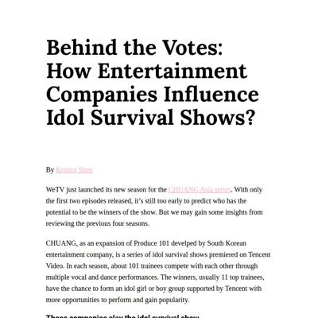 kristen-shen.github.io</a></td>
<td><a href="#ananyabchetiagithubio"> ananyabchetia.github.io</a></td>
</tr><tr>
</tr></table>

## hazel-gandhi.github.io

|url|mobile|medium|wide|
|---|---|---|---|
|[Academic Retractions](https://hazel-gandhi.github.io/academic-retractions-analysis/) :x: og:title :x: og:description :x: og:image [how to fix](https://jonathansoma.com/everything/web/social-tags/)|||[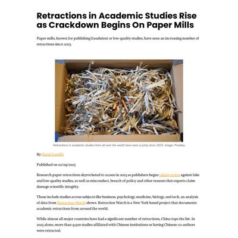](screenshots/hazel-gandhi.github.io/academic-retractions-analysis_index.html-wide-full.jpg)|

### Automatic Checks

**https://hazel-gandhi.github.io/academic-retractions-analysis/**

* 🤖 [Automatic feedback here](feedback/hazel-gandhi.github.io/academic-retractions-analysis_index.html.md)
* No issues found! 🎉

## lg3394.github.io

|url|mobile|medium|wide|
|---|---|---|---|
|[Submarine Cables: 15 Years of Growth](https://lg3394.github.io/submarinecables/) :x: og:title :x: og:description :x: og:image [how to fix](https://jonathansoma.com/everything/web/social-tags/)||||

### Automatic Checks

**https://lg3394.github.io/submarinecables/**

* Add a link to your project's GitHub repo, so people can review your code

#### [Project repository](https://github.com/lg3394/submarinecables) issues

* README needs link to project page
* README not organized into sections, use [h2/h3 headers](https://www.markdownguide.org/basic-syntax/)
* Should not include these file(s), please remove:
    * `.DS_Store`
* Notebook `submarinecablesapi.ipynb` needs more markdown documentation
* 🤖 [Automatic feedback for copy edits](feedback/lg3394.github.io/submarinecables_index.html.md)

## somaiyahhafeez.github.io

|url|mobile|medium|wide|
|---|---|---|---|
|[Cash Gap: more men than women on banknotes](https://somaiyahhafeez.github.io/banknotes/) :x: og:title :x: og:description :x: og:image [how to fix](https://jonathansoma.com/everything/web/social-tags/)|||[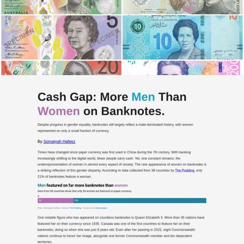](screenshots/somaiyahhafeez.github.io/banknotes_index.html-wide-full.jpg)|

### Automatic Checks

**https://somaiyahhafeez.github.io/banknotes/**

* Image: `SEC_126325676-d6ec.jpg?quality=90&strip=all&crop=0px%2C0px%2C2400px%2C1261px&resize=1200%2C630`
    * Image has text, should use [ai2html](https://www.youtube.com/playlist?list=PLewNEVDy7gq3MSrrO3eMEW8PhGMEVh2X2) for accessibility
    * Text is too small: on phones, text is as small as 2.2px. Minimum is 12px, more [here](https://service-manual.ons.gov.uk/data-visualisation/build-specifications/typography) and [here](https://nightingaledvs.com/choosing-fonts-for-your-data-visualization/)
* Dead link found: https://apnews.com/article/queen-elizabeth-ii-king-charles-iii-australia-business-25f05caba7d4d71b6952e52d695f4107
* Dead link found: https://www.womenon20s.org/campaign

#### [Project repository](https://github.com/somaiyahhafeez/banknotes) issues

* README not organized into sections, use [h2/h3 headers](https://www.markdownguide.org/basic-syntax/)
* Missing [`.gitignore`](https://jonathansoma.com/fancy-github/organization/gitignore.html) file
* Should not include these file(s), please remove:
    * `.DS_Store`
* Notebook `analysis.ipynb` should start with markdown explanation
* Notebook `analysis.ipynb` needs more markdown documentation
* Notebook `analysis-checkpoint.ipynb` should start with markdown explanation
* Notebook `analysis-checkpoint.ipynb` needs more markdown documentation
* Dead link found: https://www.banknoteworld.com/banknotes/Banknotes-by-Country/
* 🤖 [Automatic feedback for copy edits](feedback/somaiyahhafeez.github.io/banknotes_index.html.md)

## gracejiang0612.github.io

|url|mobile|medium|wide|
|---|---|---|---|
|[The Olfactory Notes That Make American Hearts Flutter](https://gracejiang0612.github.io/olfactory-families/) :x: og:title :x: og:description :x: og:image [how to fix](https://jonathansoma.com/everything/web/social-tags/)||||

### Automatic Checks

**https://gracejiang0612.github.io/olfactory-families/**

* Image: `fig1.png`
    * Image has text, should use [ai2html](https://www.youtube.com/playlist?list=PLewNEVDy7gq3MSrrO3eMEW8PhGMEVh2X2) for accessibility
    * Text is too small: on phones, text is as small as 4.0px. Minimum is 12px, more [here](https://service-manual.ons.gov.uk/data-visualisation/build-specifications/typography) and [here](https://nightingaledvs.com/choosing-fonts-for-your-data-visualization/)
* Image: `fig2.png`
    * Image has text, should use [ai2html](https://www.youtube.com/playlist?list=PLewNEVDy7gq3MSrrO3eMEW8PhGMEVh2X2) for accessibility
    * Text is too small: on phones, text is as small as 4.4px. Minimum is 12px, more [here](https://service-manual.ons.gov.uk/data-visualisation/build-specifications/typography) and [here](https://nightingaledvs.com/choosing-fonts-for-your-data-visualization/)
* Image: `fig3.png`
    * Image has text, should use [ai2html](https://www.youtube.com/playlist?list=PLewNEVDy7gq3MSrrO3eMEW8PhGMEVh2X2) for accessibility
    * Text is too small: on phones, text is as small as 4.8px. Minimum is 12px, more [here](https://service-manual.ons.gov.uk/data-visualisation/build-specifications/typography) and [here](https://nightingaledvs.com/choosing-fonts-for-your-data-visualization/)
* Image: `pic2.JPG`
    * Image is too big at 5328x4000
    * Text is too small: on phones, text is as small as 3.7px. Minimum is 12px, more [here](https://service-manual.ons.gov.uk/data-visualisation/build-specifications/typography) and [here](https://nightingaledvs.com/choosing-fonts-for-your-data-visualization/)
* Dead link found: https://www.reddit.com/r/FemFragLab/comments/1c6iur3/a_brief_analysis_of_the_most_popular_femfrags_in/
* 🤖 [Automatic feedback for copy edits](feedback/gracejiang0612.github.io/olfactory-families_index.html.md)

## rosakettumaki.github.io

|url|mobile|medium|wide|
|---|---|---|---|
|[Roller coaster story](https://rosakettumaki.github.io/roller_coaster_story/) :x: og:title :x: og:description :x: og:image [how to fix](https://jonathansoma.com/everything/web/social-tags/)|||[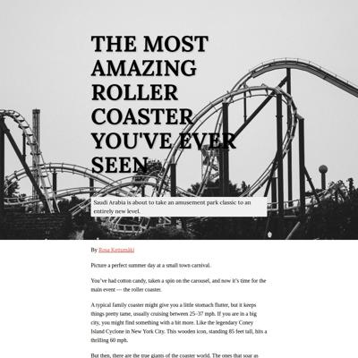](screenshots/rosakettumaki.github.io/roller_coaster_story_index.html-wide-full.jpg)|

### Automatic Checks

**https://rosakettumaki.github.io/roller_coaster_story/**

* URL should be descriptive, not including `project` or `story`
* Change URL to use `-` instead of spaces or underscores
* Dead link found: https://rcdb.com/
* Dead link found: https://www.pexels.com/

#### [Project repository](https://github.com/rosakettumaki/roller_coaster_story) issues

* README not organized into sections, use [h2/h3 headers](https://www.markdownguide.org/basic-syntax/)
* Missing [`.gitignore`](https://jonathansoma.com/fancy-github/organization/gitignore.html) file
* No Jupyter notebooks found, please add your analysis.
* 🤖 [Automatic feedback for copy edits](feedback/rosakettumaki.github.io/roller_coaster_story_index.html.md)

## ashley-yihui-lee.github.io

|url|mobile|medium|wide|
|---|---|---|---|
|[When Gender Meets Native Identity—The Income Gap for Native Women](https://ashley-yihui-lee.github.io/native-income/) :x: og:title :x: og:description :x: og:image [how to fix](https://jonathansoma.com/everything/web/social-tags/)|||[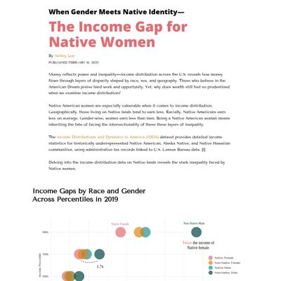](screenshots/ashley-yihui-lee.github.io/native-income_index.html-wide-full.jpg)|

### Automatic Checks

**https://ashley-yihui-lee.github.io/native-income/**

* Has sideways scrollbars in mobile version – check padding, margins, image widths
* Image: `ai2html-bubbles-_1.jpg`
    * Image has text, should use [ai2html](https://www.youtube.com/playlist?list=PLewNEVDy7gq3MSrrO3eMEW8PhGMEVh2X2) for accessibility
    * Text is too small: on phones, text is as small as 2.6px. Minimum is 12px, more [here](https://service-manual.ons.gov.uk/data-visualisation/build-specifications/typography) and [here](https://nightingaledvs.com/choosing-fonts-for-your-data-visualization/)
* Image: `ai2html-racial-_1.jpg`
    * Image has text, should use [ai2html](https://www.youtube.com/playlist?list=PLewNEVDy7gq3MSrrO3eMEW8PhGMEVh2X2) for accessibility
    * Text is too small: on phones, text is as small as 5.9px. Minimum is 12px, more [here](https://service-manual.ons.gov.uk/data-visualisation/build-specifications/typography) and [here](https://nightingaledvs.com/choosing-fonts-for-your-data-visualization/)
* Image: `ai2html-test-_1.jpg`
    * Image has text, should use [ai2html](https://www.youtube.com/playlist?list=PLewNEVDy7gq3MSrrO3eMEW8PhGMEVh2X2) for accessibility
    * Text is too small: on phones, text is as small as 2.6px. Minimum is 12px, more [here](https://service-manual.ons.gov.uk/data-visualisation/build-specifications/typography) and [here](https://nightingaledvs.com/choosing-fonts-for-your-data-visualization/)

#### [Project repository](https://github.com/ashley-yihui-lee/native-income) issues

* Failed to download repository: Failed to download repository (status code: 404)
* 🤖 [Automatic feedback for copy edits](feedback/ashley-yihui-lee.github.io/native-income_index.html.md)

## yiren54610.github.io

|url|mobile|medium|wide|
|---|---|---|---|
|[Team USA Paris Olympics](https://yiren54610.github.io/olympic_us/) :x: og:title :x: og:description :x: og:image [how to fix](https://jonathansoma.com/everything/web/social-tags/)|||[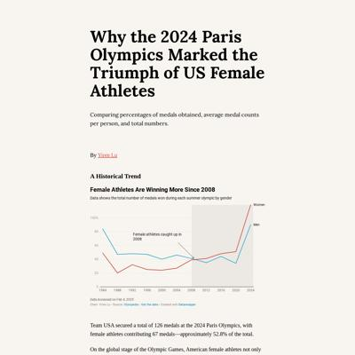](screenshots/yiren54610.github.io/olympic_us_index.html-wide-full.jpg)|

### Automatic Checks

**https://yiren54610.github.io/olympic_us/**

* Change URL to use `-` instead of spaces or underscores
* Image: `team.png`
    * Image has text, should use [ai2html](https://www.youtube.com/playlist?list=PLewNEVDy7gq3MSrrO3eMEW8PhGMEVh2X2) for accessibility
    * Text is too small: on phones, text is as small as 4.4px. Minimum is 12px, more [here](https://service-manual.ons.gov.uk/data-visualisation/build-specifications/typography) and [here](https://nightingaledvs.com/choosing-fonts-for-your-data-visualization/)
* Image: `dominant.png`
    * Image has text, should use [ai2html](https://www.youtube.com/playlist?list=PLewNEVDy7gq3MSrrO3eMEW8PhGMEVh2X2) for accessibility
    * Text is too small: on phones, text is as small as 2.9px. Minimum is 12px, more [here](https://service-manual.ons.gov.uk/data-visualisation/build-specifications/typography) and [here](https://nightingaledvs.com/choosing-fonts-for-your-data-visualization/)
* Image: `niche.png`
    * Image has text, should use [ai2html](https://www.youtube.com/playlist?list=PLewNEVDy7gq3MSrrO3eMEW8PhGMEVh2X2) for accessibility
    * Text is too small: on phones, text is as small as 4.4px. Minimum is 12px, more [here](https://service-manual.ons.gov.uk/data-visualisation/build-specifications/typography) and [here](https://nightingaledvs.com/choosing-fonts-for-your-data-visualization/)

#### [Project repository](https://github.com/yiren54610/olympic_us) issues

* .gitignore file seems empty or too small
* Should not include these file(s), please remove:
    * `.DS_Store`
    * `historical_data/.DS_Store`
* Notebook `Data_scraping.ipynb` should start with markdown explanation
* Notebook `correlation-checkpoint.ipynb` should start with markdown explanation
* Notebook `Data_scraping-checkpoint.ipynb` should start with markdown explanation
* Dead link found: https://yiren54610.github.io/MVP/olympics.html
* 🤖 [Automatic feedback for copy edits](feedback/yiren54610.github.io/olympic_us_index.html.md)

## amethystmart.github.io

|url|mobile|medium|wide|
|---|---|---|---|
|[Ebb and Flow: America's Everchanging Views on Capital Punishment](https://amethystmart.github.io/my_site/death_penalty.html) :x: og:title :x: og:description :x: og:image [how to fix](https://jonathansoma.com/everything/web/social-tags/)||||

### Automatic Checks

**https://amethystmart.github.io/my_site/death_penalty.html**

* All HTML files should be named `index.html`. If this is a personal project, move `my_site/death_penalty.html` into a folder (or repo) called `death_penalty`, then rename the file `index.html`. That way the project can be found at **/death_penalty** instead of **/death_penalty.html**. [Read more about index.html here](https://www.thoughtco.com/index-html-page-3466505) or how it works specifically with GitHub repos [on Fancy GitHub](https://jonathansoma.com/fancy-github/github-pages/#choosing-your-url)
* Change URL to use `-` instead of spaces or underscores
* Add a link to your project's GitHub repo, so people can review your code
* Could not verify link: index.html

#### [Project repository](https://github.com/amethystmart/my_site) issues

* README needs link to project page
* [README](https://jonathansoma.com/fancy-github/readme/) looks short, not enough content
* README not organized into sections, use [h2/h3 headers](https://www.markdownguide.org/basic-syntax/)
* README seems to be missing required sections: description, data collection, data analysis, skills, reflections or future work
* Missing [`.gitignore`](https://jonathansoma.com/fancy-github/organization/gitignore.html) file
* No Jupyter notebooks found, please add your analysis.
* No data files found. Include your raw/processed data or document where it can be accessed
* 🤖 [Automatic feedback for copy edits](feedback/amethystmart.github.io/my_site_death_penalty.html.md)

## annikamcginnis.github.io

|url|mobile|medium|wide|
|---|---|---|---|
|[The American West Faces a Fiery Future](https://annikamcginnis.github.io/wildfires-fema/) :x: og:title :x: og:description :x: og:image [how to fix](https://jonathansoma.com/everything/web/social-tags/)|[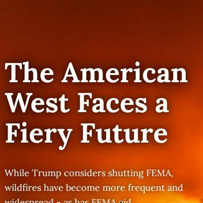](screenshots/annikamcginnis.github.io/wildfires-fema_index.html-mobile-full.jpg)|||

### Automatic Checks

**https://annikamcginnis.github.io/wildfires-fema/**

* Dead link found: https://annikamcginnis.github.io/portfolio/
* Could not verify link: https://www.fema.gov/openfema-data-page/fema-web-disaster-declarations-v1
* Could not verify link: https://www.fema.gov/disaster/historic/coronavirus/governments
* Dead link found: https://stateline.org/2025/02/06/trump-wants-states-to-handle-disasters-without-fema-they-say-they-cant/
* Could not verify link: https://www.washingtonpost.com/national-security/2025/02/09/fema-shutdown-noem-trump/
* Could not verify link: https://www.washingtonpost.com/climate-environment/2025/02/07/musk-trump-fema-doge/

#### [Project repository](https://github.com/annikamcginnis/wildfires-fema) issues

* Should not include these file(s), please remove:
    * `.DS_Store`
* Notebook `Billion Dollar Disasters Data Cleaning.ipynb` needs more markdown documentation
* Notebook `FEMA Data Analysis.ipynb` needs more markdown documentation
* Notebook `Billion Dollar Disasters Data Scrape.ipynb` needs more markdown documentation
* 🤖 [Automatic feedback for copy edits](feedback/annikamcginnis.github.io/wildfires-fema_index.html.md)

## rm4063.github.io

|url|mobile|medium|wide|
|---|---|---|---|
|[Site not found · GitHub Pages](https://rm4063.github.io/project1/) :x: og:title :x: og:description :x: og:image [how to fix](https://jonathansoma.com/everything/web/social-tags/)|request failed|request failed|request failed|

### Automatic Checks

**https://rm4063.github.io/project1/**

* **Could not access the page** - if you moved it, [let me know](https://github.com/jsoma/data-studio-projects-2024/issues/new/choose)!
* 🤖 [Automatic feedback for copy edits](feedback/rm4063.github.io/project1_index.html.md)

## cj-robinson.github.io

|url|mobile|medium|wide|
|---|---|---|---|
|[C.J. Robinson](https://cj-robinson.github.io/2024-nyc-evictions/)|[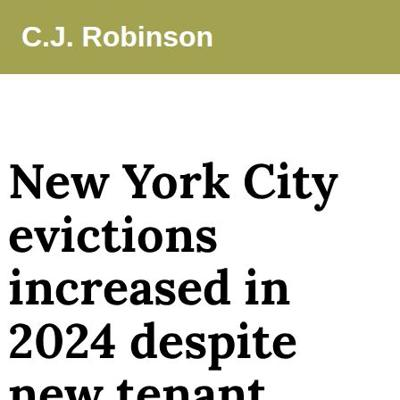](screenshots/cj-robinson.github.io/2024-nyc-evictions_index.html-mobile-full.jpg)|||

### Automatic Checks

**https://cj-robinson.github.io/2024-nyc-evictions/**

* Has sideways scrollbars in mobile version – check padding, margins, image widths

#### [Project repository](https://github.com/cj-robinson/2024-nyc-evictions) issues

* README not organized into sections, use [h2/h3 headers](https://www.markdownguide.org/basic-syntax/)
* README seems to be missing required sections: reflections or future work
* 🤖 [Automatic feedback for copy edits](feedback/cj-robinson.github.io/2024-nyc-evictions_index.html.md)

## anusha0712.github.io

|url|mobile|medium|wide|
|---|---|---|---|
|[Visualizing Banned Books in American Schools](https://anusha0712.github.io/banned-books/) :x: og:title :x: og:description :x: og:image [how to fix](https://jonathansoma.com/everything/web/social-tags/)||||

### Automatic Checks

**https://anusha0712.github.io/banned-books/**

* Add a link to your project's GitHub repo, so people can review your code
* Image: `cover.jpg`
    * Image is too big at 6000x3376
    * Text is too small: on phones, text is as small as 5.9px. Minimum is 12px, more [here](https://service-manual.ons.gov.uk/data-visualisation/build-specifications/typography) and [here](https://nightingaledvs.com/choosing-fonts-for-your-data-visualization/)
* Image: `treemap_final-01.svg` Text is too small: on phones, text is as small as 5.9px. Minimum is 12px, more [here](https://service-manual.ons.gov.uk/data-visualisation/build-specifications/typography) and [here](https://nightingaledvs.com/choosing-fonts-for-your-data-visualization/)
* Image: `radial_final.svg` Text is too small: on phones, text is as small as 5.9px. Minimum is 12px, more [here](https://service-manual.ons.gov.uk/data-visualisation/build-specifications/typography) and [here](https://nightingaledvs.com/choosing-fonts-for-your-data-visualization/)
* Dead link found: https://apnews.com/article/salman-rushdie-satanic-verses-india-ban-4b389bd17238c50c7a1373bc38896490

#### [Project repository](https://github.com/anusha0712/banned-books) issues

* Could not verify link: https://docs.google.com/spreadsheets/d/1hTs_PB7KuTMBtNMESFEGuK-0abzhNxVv4tgpI5-iKe8/edit?gid=1171606318#gid=1171606318
* 🤖 [Automatic feedback for copy edits](feedback/anusha0712.github.io/banned-books_index.html.md)

## suiumkanulanbek.github.io

|url|mobile|medium|wide|
|---|---|---|---|
|[Story template](https://suiumkanulanbek.github.io/project1/) :x: og:title :x: og:description :x: og:image [how to fix](https://jonathansoma.com/everything/web/social-tags/)||||

### Automatic Checks

**https://suiumkanulanbek.github.io/project1/**

* URL should be descriptive, not including `project` or `story`
* Add a link to your project's GitHub repo, so people can review your code
* Image: `diseases.png`
    * Image has text, should use [ai2html](https://www.youtube.com/playlist?list=PLewNEVDy7gq3MSrrO3eMEW8PhGMEVh2X2) for accessibility
    * Text is too small: on phones, text is as small as 3.9px. Minimum is 12px, more [here](https://service-manual.ons.gov.uk/data-visualisation/build-specifications/typography) and [here](https://nightingaledvs.com/choosing-fonts-for-your-data-visualization/)
* Image: `diseases2.png`
    * Image has text, should use [ai2html](https://www.youtube.com/playlist?list=PLewNEVDy7gq3MSrrO3eMEW8PhGMEVh2X2) for accessibility
    * Text is too small: on phones, text is as small as 4.4px. Minimum is 12px, more [here](https://service-manual.ons.gov.uk/data-visualisation/build-specifications/typography) and [here](https://nightingaledvs.com/choosing-fonts-for-your-data-visualization/)
* Dead link found: https://www.reddit.com/r/ChronicIllness/comments/1gx0sei/struggling_with_two_rare_diseases_and_denied/
* Dead link found: https://www.reddit.com/r/ChronicIllness/comments/1db8mlc/having_an_orphan_disease_is_so_unfair/
* Dead link found: https://pmc.ncbi.nlm.nih.gov/articles/PMC9004040/#_ad93_

#### [Project repository](https://github.com/suiumkanulanbek/project1) issues

* README needs link to project page
* [README](https://jonathansoma.com/fancy-github/readme/) looks short, not enough content
* README not organized into sections, use [h2/h3 headers](https://www.markdownguide.org/basic-syntax/)
* README seems to be missing required sections: description, data collection, skills, reflections or future work
* Missing [`.gitignore`](https://jonathansoma.com/fancy-github/organization/gitignore.html) file
* No Jupyter notebooks found, please add your analysis.
* 🤖 [Automatic feedback for copy edits](feedback/suiumkanulanbek.github.io/project1_index.html.md)

## chilinhhovo.github.io

|url|mobile|medium|wide|
|---|---|---|---|
|[Mercury craters](https://chilinhhovo.github.io/Mercury/) :x: og:title :x: og:description :x: og:image [how to fix](https://jonathansoma.com/everything/web/social-tags/)|[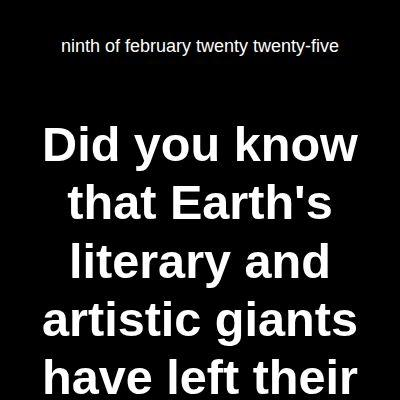](screenshots/chilinhhovo.github.io/Mercury_index.html-mobile-full.jpg)||[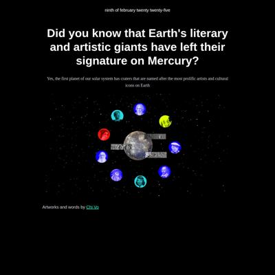](screenshots/chilinhhovo.github.io/Mercury_index.html-wide-full.jpg)|

### Automatic Checks

**https://chilinhhovo.github.io/Mercury/**

* Change URL to be all in lowercase
* 🤖 [Automatic feedback for copy edits](feedback/chilinhhovo.github.io/Mercury_index.html.md)

## tiff-xwang.github.io

|url|mobile|medium|wide|
|---|---|---|---|
|[Tinned Fish](https://tiff-xwang.github.io/tinned-fish/) :x: og:title :x: og:description :x: og:image [how to fix](https://jonathansoma.com/everything/web/social-tags/)|[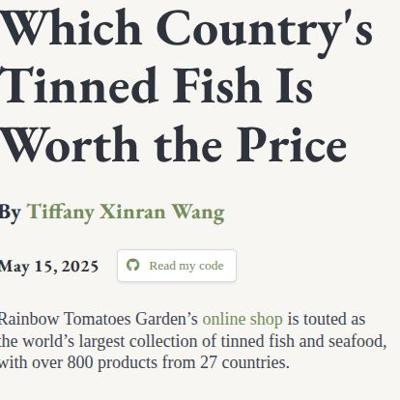](screenshots/tiff-xwang.github.io/tinned-fish_index.html-mobile-full.jpg)|||

### Automatic Checks

**https://tiff-xwang.github.io/tinned-fish/**

* Missing viewport meta tag in `<head>`, needed to tell browser it's responsive. Add `<meta name="viewport" content="width=device-width, initial-scale=1, shrink-to-fit=no">`
* Has sideways scrollbars in mobile version – check padding, margins, image widths
* Add a link to your project's GitHub repo, so people can review your code
* Image: `full.png`
    * Image has text, should use [ai2html](https://www.youtube.com/playlist?list=PLewNEVDy7gq3MSrrO3eMEW8PhGMEVh2X2) for accessibility
    * Text is too small: on phones, text is as small as 3.7px. Minimum is 12px, more [here](https://service-manual.ons.gov.uk/data-visualisation/build-specifications/typography) and [here](https://nightingaledvs.com/choosing-fonts-for-your-data-visualization/)
* Image: `full.png`
    * Image has text, should use [ai2html](https://www.youtube.com/playlist?list=PLewNEVDy7gq3MSrrO3eMEW8PhGMEVh2X2) for accessibility
    * Text is too small: on phones, text is as small as 3.7px. Minimum is 12px, more [here](https://service-manual.ons.gov.uk/data-visualisation/build-specifications/typography) and [here](https://nightingaledvs.com/choosing-fonts-for-your-data-visualization/)
* Image: `full.png`
    * Image has text, should use [ai2html](https://www.youtube.com/playlist?list=PLewNEVDy7gq3MSrrO3eMEW8PhGMEVh2X2) for accessibility
    * Text is too small: on phones, text is as small as 3.7px. Minimum is 12px, more [here](https://service-manual.ons.gov.uk/data-visualisation/build-specifications/typography) and [here](https://nightingaledvs.com/choosing-fonts-for-your-data-visualization/)
* Image: `full.png`
    * Image has text, should use [ai2html](https://www.youtube.com/playlist?list=PLewNEVDy7gq3MSrrO3eMEW8PhGMEVh2X2) for accessibility
    * Text is too small: on phones, text is as small as 3.7px. Minimum is 12px, more [here](https://service-manual.ons.gov.uk/data-visualisation/build-specifications/typography) and [here](https://nightingaledvs.com/choosing-fonts-for-your-data-visualization/)

#### [Project repository](https://github.com/tiff-xwang/tinned-fish) issues

* Failed to download repository: Failed to download repository (status code: 404)
* 🤖 [Automatic feedback for copy edits](feedback/tiff-xwang.github.io/tinned-fish_index.html.md)

## yatingw24.github.io

|url|mobile|medium|wide|
|---|---|---|---|
|[Phoenix From the Ashes: The Tragedy Only Makes Jean Grey, aka the Dark Phoenix, Continues to be a fan Favorite](https://yatingw24.github.io/X-men/) :x: og:title :x: og:description :x: og:image [how to fix](https://jonathansoma.com/everything/web/social-tags/)||||

### Automatic Checks

**https://yatingw24.github.io/X-men/**

* Change URL to be all in lowercase
* Image(s) need `alt` tags, [info here](https://abilitynet.org.uk/news-blogs/five-golden-rules-compliant-alt-text) and [tips here](https://twitter.com/FrankElavsky/status/1469023374529765385)
    * Image `scrolly-images/simage1.jpg` missing `alt` tag
* Image: `simage1.jpg`
    * Image is too big at 5472x3648
    * Text is too small: on phones, text is as small as 2.2px. Minimum is 12px, more [here](https://service-manual.ons.gov.uk/data-visualisation/build-specifications/typography) and [here](https://nightingaledvs.com/choosing-fonts-for-your-data-visualization/)
* Image: `chart1.png`
    * Image has text, should use [ai2html](https://www.youtube.com/playlist?list=PLewNEVDy7gq3MSrrO3eMEW8PhGMEVh2X2) for accessibility
    * Text is too small: on phones, text is as small as 3.7px. Minimum is 12px, more [here](https://service-manual.ons.gov.uk/data-visualisation/build-specifications/typography) and [here](https://nightingaledvs.com/choosing-fonts-for-your-data-visualization/)
* Image: `chart2.png`
    * Image has text, should use [ai2html](https://www.youtube.com/playlist?list=PLewNEVDy7gq3MSrrO3eMEW8PhGMEVh2X2) for accessibility
    * Text is too small: on phones, text is as small as 2.2px. Minimum is 12px, more [here](https://service-manual.ons.gov.uk/data-visualisation/build-specifications/typography) and [here](https://nightingaledvs.com/choosing-fonts-for-your-data-visualization/)
* Image: `chart3.png`
    * Image has text, should use [ai2html](https://www.youtube.com/playlist?list=PLewNEVDy7gq3MSrrO3eMEW8PhGMEVh2X2) for accessibility
    * Text is too small: on phones, text is as small as 2.9px. Minimum is 12px, more [here](https://service-manual.ons.gov.uk/data-visualisation/build-specifications/typography) and [here](https://nightingaledvs.com/choosing-fonts-for-your-data-visualization/)

#### [Project repository](https://github.com/yatingw24/X-men) issues

* Missing [`.gitignore`](https://jonathansoma.com/fancy-github/organization/gitignore.html) file
* Should not include these file(s), please remove:
    * `.DS_Store`
* Notebook `X-men_analysis.ipynb` should start with markdown explanation
* Notebook `X-men_analysis-checkpoint.ipynb` should start with markdown explanation
* 🤖 [Automatic feedback for copy edits](feedback/yatingw24.github.io/X-men_index.html.md)

## shuoshuobar.github.io

|url|mobile|medium|wide|
|---|---|---|---|
|[Story template](https://shuoshuobar.github.io/Low-Food-Access-Across-Race/) :x: og:title :x: og:description :x: og:image [how to fix](https://jonathansoma.com/everything/web/social-tags/)||||

### Automatic Checks

**https://shuoshuobar.github.io/Low-Food-Access-Across-Race/**

* Change URL to be all in lowercase
* Image(s) need `alt` tags, [info here](https://abilitynet.org.uk/news-blogs/five-golden-rules-compliant-alt-text) and [tips here](https://twitter.com/FrankElavsky/status/1469023374529765385)
    * Image `black-african-americans.png` missing `alt` tag
    * Image `american-indians-alaska-natives.png` missing `alt` tag
    * Image `native-hawaiians-other-pacific-islanders.png` missing `alt` tag
    * Image `asians.png` missing `alt` tag
    * Image `hispanics-latinos.png` missing `alt` tag
    * *and 2 more*
* Image: `black-african-americans.png`
    * Image has text, should use [ai2html](https://www.youtube.com/playlist?list=PLewNEVDy7gq3MSrrO3eMEW8PhGMEVh2X2) for accessibility
    * Text is too small: on phones, text is as small as 3.7px. Minimum is 12px, more [here](https://service-manual.ons.gov.uk/data-visualisation/build-specifications/typography) and [here](https://nightingaledvs.com/choosing-fonts-for-your-data-visualization/)
* Image: `american-indians-alaska-natives.png`
    * Image has text, should use [ai2html](https://www.youtube.com/playlist?list=PLewNEVDy7gq3MSrrO3eMEW8PhGMEVh2X2) for accessibility
    * Text is too small: on phones, text is as small as 3.7px. Minimum is 12px, more [here](https://service-manual.ons.gov.uk/data-visualisation/build-specifications/typography) and [here](https://nightingaledvs.com/choosing-fonts-for-your-data-visualization/)
* Image: `native-hawaiians-other-pacific-islanders.png`
    * Image has text, should use [ai2html](https://www.youtube.com/playlist?list=PLewNEVDy7gq3MSrrO3eMEW8PhGMEVh2X2) for accessibility
    * Text is too small: on phones, text is as small as 3.3px. Minimum is 12px, more [here](https://service-manual.ons.gov.uk/data-visualisation/build-specifications/typography) and [here](https://nightingaledvs.com/choosing-fonts-for-your-data-visualization/)
* Image: `asians.png`
    * Image has text, should use [ai2html](https://www.youtube.com/playlist?list=PLewNEVDy7gq3MSrrO3eMEW8PhGMEVh2X2) for accessibility
    * Text is too small: on phones, text is as small as 3.3px. Minimum is 12px, more [here](https://service-manual.ons.gov.uk/data-visualisation/build-specifications/typography) and [here](https://nightingaledvs.com/choosing-fonts-for-your-data-visualization/)
* Image: `hispanics-latinos.png`
    * Image has text, should use [ai2html](https://www.youtube.com/playlist?list=PLewNEVDy7gq3MSrrO3eMEW8PhGMEVh2X2) for accessibility
    * Text is too small: on phones, text is as small as 3.3px. Minimum is 12px, more [here](https://service-manual.ons.gov.uk/data-visualisation/build-specifications/typography) and [here](https://nightingaledvs.com/choosing-fonts-for-your-data-visualization/)
* Image: `white-people.png`
    * Image has text, should use [ai2html](https://www.youtube.com/playlist?list=PLewNEVDy7gq3MSrrO3eMEW8PhGMEVh2X2) for accessibility
    * Text is too small: on phones, text is as small as 3.3px. Minimum is 12px, more [here](https://service-manual.ons.gov.uk/data-visualisation/build-specifications/typography) and [here](https://nightingaledvs.com/choosing-fonts-for-your-data-visualization/)
* Image: `other-multiple-race-people.png`
    * Image has text, should use [ai2html](https://www.youtube.com/playlist?list=PLewNEVDy7gq3MSrrO3eMEW8PhGMEVh2X2) for accessibility
    * Text is too small: on phones, text is as small as 3.3px. Minimum is 12px, more [here](https://service-manual.ons.gov.uk/data-visualisation/build-specifications/typography) and [here](https://nightingaledvs.com/choosing-fonts-for-your-data-visualization/)

#### [Project repository](https://github.com/shuoshuobar/Low-Food-Access-Across-Race) issues

* README needs link to project page
* Missing [`.gitignore`](https://jonathansoma.com/fancy-github/organization/gitignore.html) file
* Should not include these file(s), please remove:
    * `.DS_Store`
    * `Charts/.DS_Store`
    * `2010 Food Access Research Atlas/.DS_Store`
* 🤖 [Automatic feedback for copy edits](feedback/shuoshuobar.github.io/Low-Food-Access-Across-Race_index.html.md)

## jcw2245.github.io

|url|mobile|medium|wide|
|---|---|---|---|
|[Abortion data for Project 1](https://jcw2245.github.io/Project-1/) :x: og:title :x: og:description :x: og:image [how to fix](https://jonathansoma.com/everything/web/social-tags/)||||

### Automatic Checks

**https://jcw2245.github.io/Project-1/**

* URL should be descriptive, not including `project` or `story`
* Change URL to be all in lowercase
* Has sideways scrollbars in mobile version – check padding, margins, image widths
* Image(s) need `alt` tags, [info here](https://abilitynet.org.uk/news-blogs/five-golden-rules-compliant-alt-text) and [tips here](https://twitter.com/FrankElavsky/status/1469023374529765385)
    * Image `abortion_pic.jpg` missing `alt` tag
* Add a link to your project's GitHub repo, so people can review your code
* Datawrapper chart missing description, fill out *Alternative description for screen readers* section on Annotate tab, [tips here](https://twitter.com/FrankElavsky/status/1469023374529765385)
* Datawrapper chart missing description, fill out *Alternative description for screen readers* section on Annotate tab, [tips here](https://twitter.com/FrankElavsky/status/1469023374529765385)
* Image: `abortion_pic.jpg`
    * Image is too big at 4024x6048
    * Image has text, should use [ai2html](https://www.youtube.com/playlist?list=PLewNEVDy7gq3MSrrO3eMEW8PhGMEVh2X2) for accessibility
    * Text is too small: on phones, text is as small as 8.8px. Minimum is 12px, more [here](https://service-manual.ons.gov.uk/data-visualisation/build-specifications/typography) and [here](https://nightingaledvs.com/choosing-fonts-for-your-data-visualization/)
* Image: `full.png`
    * Image has text, should use [ai2html](https://www.youtube.com/playlist?list=PLewNEVDy7gq3MSrrO3eMEW8PhGMEVh2X2) for accessibility
    * Text is too small: on phones, text is as small as 4.4px. Minimum is 12px, more [here](https://service-manual.ons.gov.uk/data-visualisation/build-specifications/typography) and [here](https://nightingaledvs.com/choosing-fonts-for-your-data-visualization/)
* Image: `full.png`
    * Image has text, should use [ai2html](https://www.youtube.com/playlist?list=PLewNEVDy7gq3MSrrO3eMEW8PhGMEVh2X2) for accessibility
    * Text is too small: on phones, text is as small as 4.4px. Minimum is 12px, more [here](https://service-manual.ons.gov.uk/data-visualisation/build-specifications/typography) and [here](https://nightingaledvs.com/choosing-fonts-for-your-data-visualization/)
* 🤖 [Automatic feedback for copy edits](feedback/jcw2245.github.io/Project-1_index.html.md)

## kristen-shen.github.io

|url|mobile|medium|wide|
|---|---|---|---|
|[Idol Survival Show](https://kristen-shen.github.io/idol-show/) :x: og:title :x: og:description :x: og:image [how to fix](https://jonathansoma.com/everything/web/social-tags/)||||

### Automatic Checks

**https://kristen-shen.github.io/idol-show/**

* Image: `logos.png`
    * Image has text, should use [ai2html](https://www.youtube.com/playlist?list=PLewNEVDy7gq3MSrrO3eMEW8PhGMEVh2X2) for accessibility
    * Text is too small: on phones, text is as small as 2.9px. Minimum is 12px, more [here](https://service-manual.ons.gov.uk/data-visualisation/build-specifications/typography) and [here](https://nightingaledvs.com/choosing-fonts-for-your-data-visualization/)
* Dead link found: https://github.com/Kristen-Shen/Kristen-Shen.github.io/tree/main/idol_show

#### [Project repository](https://github.com/kristen-shen/idol-show) issues

* Failed to download repository: Failed to download repository (status code: 404)
* 🤖 [Automatic feedback for copy edits](feedback/kristen-shen.github.io/idol-show_index.html.md)

## ananyabchetia.github.io

|url|mobile|medium|wide|
|---|---|---|---|
|[Ananya's data stories](https://ananyabchetia.github.io/penguins) :x: og:title :x: og:description :x: og:image [how to fix](https://jonathansoma.com/everything/web/social-tags/)|||[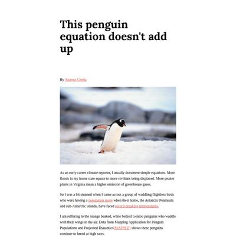](screenshots/ananyabchetia.github.io/penguins_index.html-wide-full.jpg)|

### Automatic Checks

**https://ananyabchetia.github.io/penguins**

* Has sideways scrollbars in mobile version – check padding, margins, image widths
* Image(s) need `alt` tags, [info here](https://abilitynet.org.uk/news-blogs/five-golden-rules-compliant-alt-text) and [tips here](https://twitter.com/FrankElavsky/status/1469023374529765385)
    * Image `gentoopenguinphoto.jpg` missing `alt` tag
* Add a link to your project's GitHub repo, so people can review your code
* Datawrapper chart missing description, fill out *Alternative description for screen readers* section on Annotate tab, [tips here](https://twitter.com/FrankElavsky/status/1469023374529765385)
* Datawrapper chart missing description, fill out *Alternative description for screen readers* section on Annotate tab, [tips here](https://twitter.com/FrankElavsky/status/1469023374529765385)
* Datawrapper chart missing description, fill out *Alternative description for screen readers* section on Annotate tab, [tips here](https://twitter.com/FrankElavsky/status/1469023374529765385)
* 🤖 [Automatic feedback for copy edits](feedback/ananyabchetia.github.io/penguins_index.html.md)

